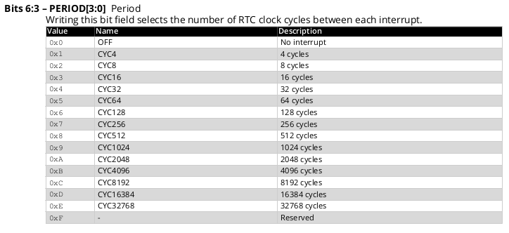

# RTC Real Time Counter Module

Here be Magic.

The RTC divides incoming tick-tocks from a single, selected clock source into multiple, simultaneously available, outgoing signals indicating different intervals of time.

Clock sources include:

* 32,768 Hz (32K) internal oscillator
* that same oscillator, divided by 32
* external, 32,768 Hz crystal oscillator
* external clock of perhaps some other, different frequency

This article will focus on the internal 32K oscillator, named OSC32. The following code statement,

```RTC.CLKSEL = RTC_CLKSEL_OSC32K_gc;```,

directs pulses 32,768 pulses per second, more or less, into the RTC. OSC32 aims to conserve power consumption, eliminates an external part and may come close enough to 32K for practical purposes.

(For better accuracy, consider an external 32K crystal. That's to be covered in another article.) 

Incoming pulses increment a 15-bit integer called the Prescaler. The thing simply counts up from 0 to 32767<br>then starts over at 0,<br>repeat<br>repeat<br>repeat. 

Comes now the Magic.

Each of the 15 bits of the Prescaler simultaneously generates a signal. The signal from any one of the bits can be used, again simultaneously, in up to three different ways:

1. as a clock into a more or less conventional, 16-bit timer capable of generating interrupts at  custom intervals configured in program code;

2. periodic interrupts at frequencies of 32,768 Hz divided by a power of 2;

3. to activate or to deactivate another peripheral directly, according to the logical level of a selected bit in the Prescaler, without interrupting or in any way involving the CPU.

An example of the third use case, called an "event", could be to have the ADC perform a conversion every 1/4 of a second. The most recent conversion result would then always available be available to read.

Eight of such level events, having different periodic duration, are available to other peripherals through a Event System built into the AVR64DD28.

The hardware makes all of those signals available simultaneously. Program code needs only to turn the RTC on, then select which one or more of the signals to use. To be clear, the different signals can be put to different uses concurrently.

Breathtaking! We pause here to catch our breath.

### Periodic Interrupts

This article dwells on use case #2, the periodic interrupts. The following, short program demonstrates using the Periodic Interrupt Timer (PIT) of the RTC to blink an LED at 1/2-second intervals.

<pre><code>

/*
 * Blink an LED on an AVR64DD28
 * Using Periodic Interrupt of the Real Time Counter module.
 * Avoid using any Arduino setup code.
 * 
 * Copyright (c) 2024 David G. Sparks  All right reserved.
 *
 * The code is designed for compilation with the Arduino IDE.
 * It uses only names defined in the device data sheet
 * and in the device header file.
 * This approach thus avoids Arduino-specific library references,
 * in hopes that it may be possible to compile with other workflows
 * having access to the device header file. 
 *
 * This program is free software; you can redistribute it and/or
 * modify it under the terms of the GNU Lesser General Public
 * License as published by the Free Software Foundation; either
 * version 2.1 of the License, or (at your option) any later version.
 *
 * This program is distributed in the hope that it will be useful,
 * but WITHOUT ANY WARRANTY; without even the implied warranty of
 * MERCHANTABILITY or FITNESS FOR A PARTICULAR PURPOSE.  See the GNU
 * Lesser General Public License for more details.
 *
 * To obtain a copy of the GNU Lesser General Public
 * License, write to the Free Software Foundation, Inc., 
 * 51 Franklin St, Fifth Floor, Boston, MA  02110-1301  USA
 */

void setup() {

  // Attach an LED to pin PA6.
  
  PORTA.DIRSET = PIN6_bm;		// set PA6 direction to OUTPUT
  PORTA.OUTSET = PIN6_bm;		// set PA6 level to HIGH

  //   Wait for RTC to synchronize with the system clock.
  while (RTC.STATUS & RTC_CTRLABUSY_bm) { ; /* wait */ }
  //   Select the OSC32 clock source
  RTC.CLKSEL = RTC_CLKSEL_OSC32K_gc;

  //   Enable the PIT interrupt
  RTC.PITINTCTRL = RTC_PI_bm;

  //   Wait for the PIT to synchronize with the system clock.
  while (RTC.PITSTATUS & RTC_CTRLBUSY_bm) { ; /* wait */ }
  // Choose 16384/32768 = 1/2 - second interval and enable the PIT
  RTC.PITCTRLA = 
       RTC_PERIOD_CYC16384_gc
     | RTC_PITEN_bm;  

  // enable interrupts globally
  sei();
}

void loop() {

  // nothing happens here

}

// build program without Arduino library overhead

int main()
{
  setup();
  while (1) { loop(); }
  return 0;
}

// handle the PIT interrupt

ISR(RTC_PIT_vect)
{
  RTC.PITINTFLAGS = RTC_PI_bm;  // clear the PIT interrupt flag
  PORTA.OUTTGL = PIN6_bm;       // toggle the level of pin PA6
}
</code></pre>

The PIT feature of the RTC module configures a periodic interrupt in a more straightforward way compared to a conventional timer/counter. Merely select from a set of predefined intervals in a range of (&nbsp;4&nbsp;/&nbsp;32768&nbsp;) = 122 microseconds up to one second. 

Available Period lengths are documented on page 367 of the data sheet as shown in the following excerpt:



Referring to the Description column in the table, the duration of a Period in the program listed above would be the fraction of a second equal to &lt;cycles&gt; / 32768.

The program employs macros defined in the device header file to represent the different Period names. The macros shift the relevant value into the correct bit position of the targeted field in the PITCTRLA register. Please refer to the data sheet and the header file for a more detailed explanation. 

### Conventional Timer Interrupts

The RTC module supports use case #1 with a set of three registers and two available interrupts. Any one of the bits from the prescaler can be selected to update the separate, 16-bit Counter register. User code can configure a "TOP" counter value in the Period register to raise Overflow interrupts at a chosen frequency. Additionally, the Compare register can be programmed to trigger a Compare Match interrupt. 

In this way the RTC resembles a conventional timer/counter, albeit it one clocked in kilohertz rather than in megahertz. The RTC Overflow and Compare Match interrupts can be active during the same time that the PIT is generating a Periodic interrupt having some other, selected frequency.

### Events

The third use case belongs all by itself in an article on the Events module.

One more attribute deserves mention in this introductory article about the RTC: it can wake the device up from any sleep mode.

### Sleep

According to the data sheet, 

<blockquote>
The RTC peripheral typically runs continuously, including in Low-Power sleep modes, to keep track of time. It can wake up the device from sleep modes, and/or interrupt the device at regular intervals.
</blockquote>

In fact it is the only module in the device that can run during the most current-thrifty mode, Power Down Sleep, yet still restore the device to the fully active state by means of an internally generated signal.

Such a capability may have value for long-lived operation on batteries. The topic deserves separate coverage in an article on the Sleep modes.

### Other Posts in this Blog 

<ul>
  
    <li>
      <h4>
        <a href="{{site.baseurl}}{{ post.url }}"       
        
           style="color: black;"
        >{{ post.title }}
        </a>
        
        
          &nbsp; << You are here.
        
        
      </h4>
    </li>
  
</ul>

